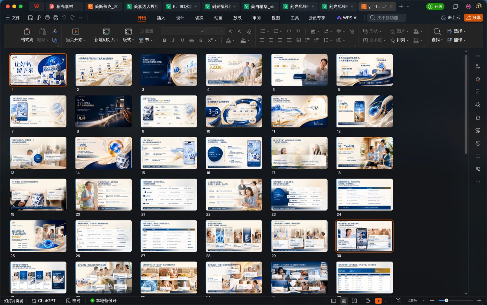
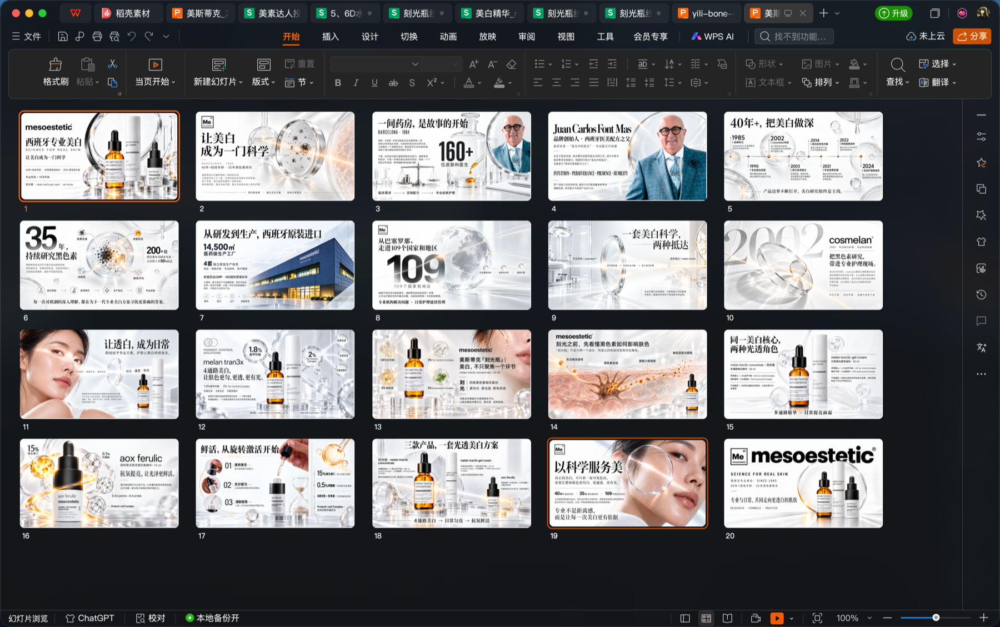
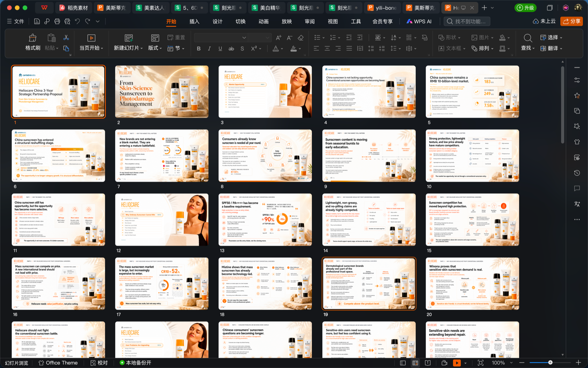
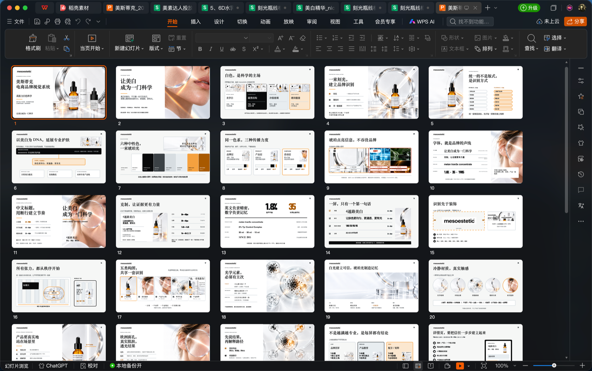
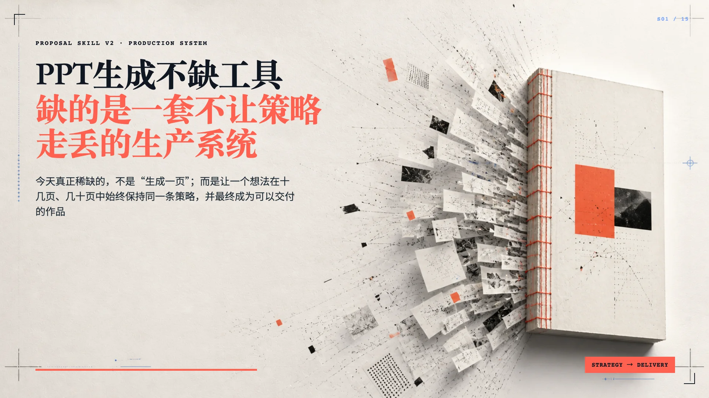
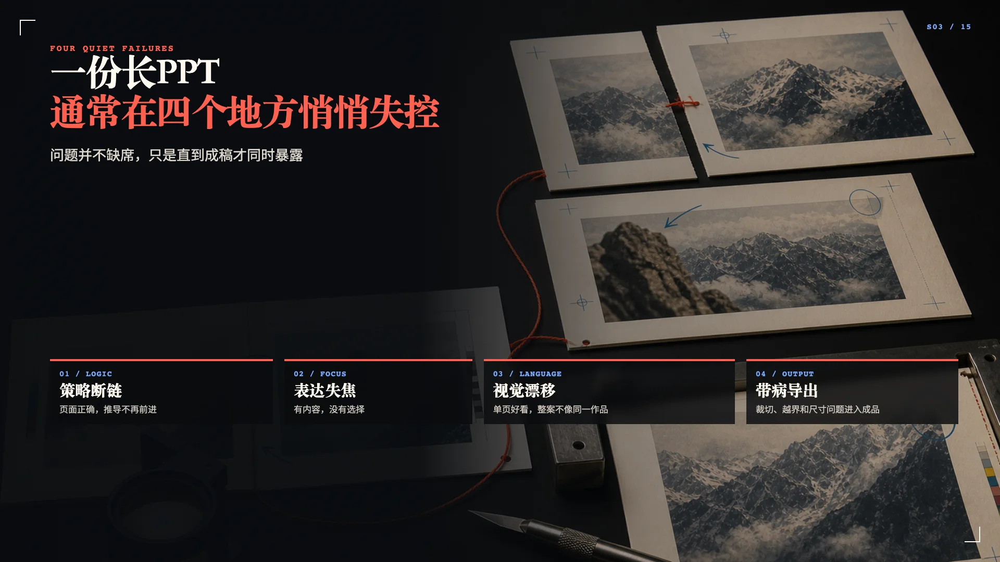
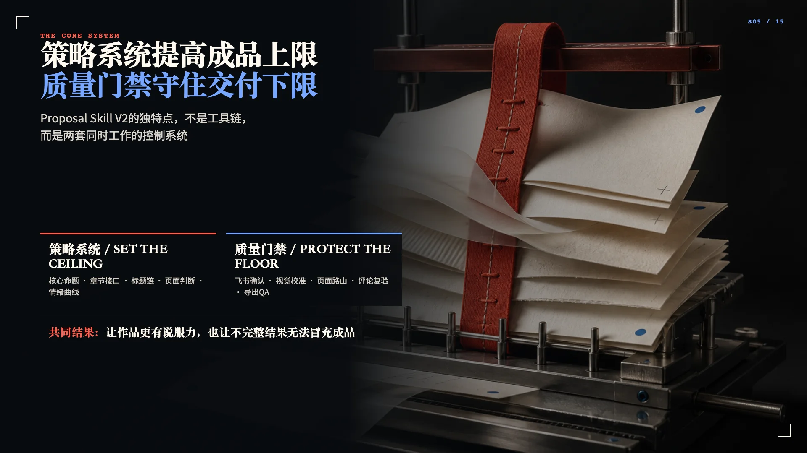
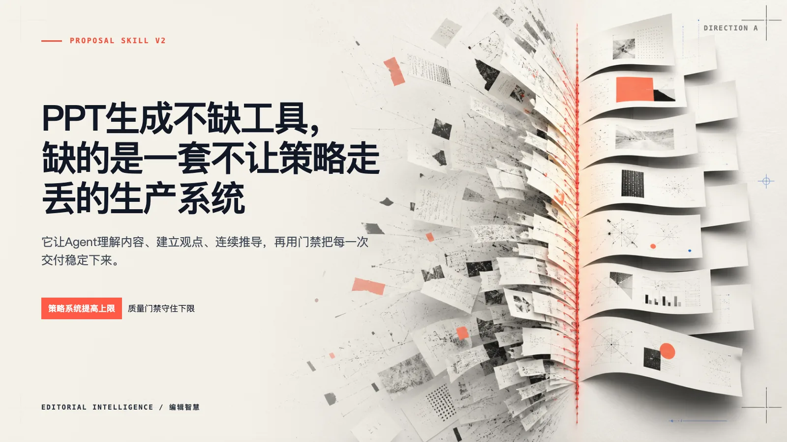
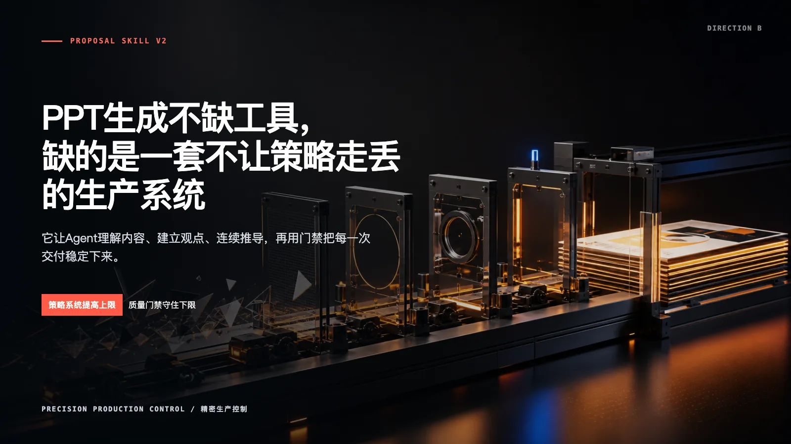
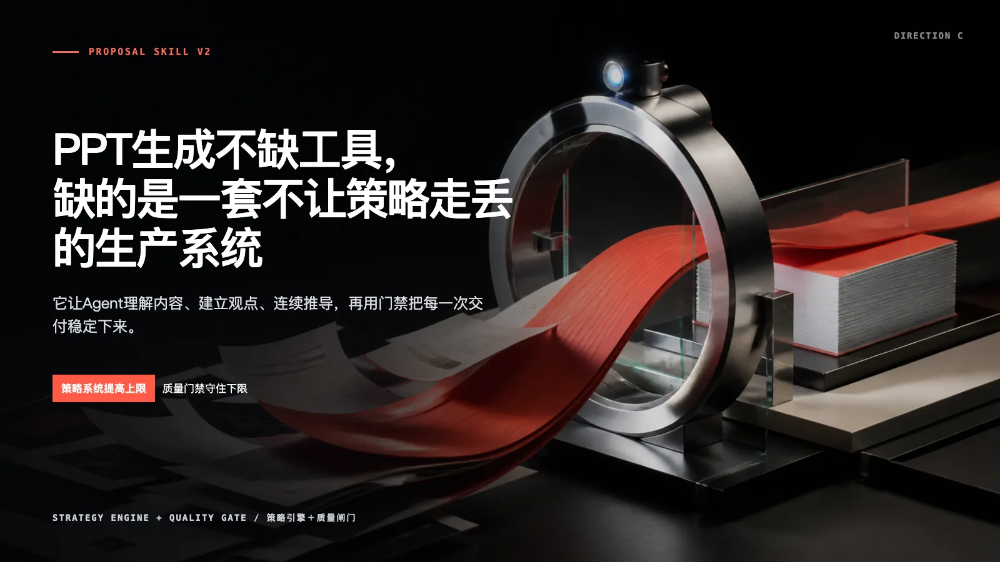

<p align="center">
  
</p>

<h1 align="center">Proposal Skill V2<br><sub>从一个想法到一份可交付的作品 / From an idea to a deliverable</sub></h1>

<p align="center">
  <strong>让 Agent 不只是生成页面，而是把一个想法推进成一套可呈现、可验证、可交付的作品。</strong><br>
  <em>Not just page generation: a governed system for turning ideas into presentable, verifiable, deliverable work.</em>
</p>

<p align="center">
  
  
  
  
  
</p>

---

大多数 PPT Skill 优化的是最后一步：把已有文字放进模板。

Proposal Skill V2 管理的是从想法到成品的整条链路：理解资料、建立观点、保持策略连续、选择表达载体、锁定视觉语言、吸收评论、完成 QA，最后才导出 PPTX、PDF 和 PNG。

> **策略系统决定作品上限，质量门禁守住交付下限。**

[快速安装](#三分钟开始) · [核心差别](#它和普通-ppt-skill-有什么不同) · [完整工作流](#一条从想法到成品的生产链) · [任务模式](#不只是长提案) · [兼容边界](#不绑定-codex-订阅) · [English](#english)

## 先看成品

下面不是设计模板，而是由同一套策略主轴、视觉语言和页面生产回环生成的真实脱敏样章。

### 最近案例 / Recent case work

下面四组截图来自近期真实提案的页面缩略图，用来展示这套方法如何跨越营养健康、医美护肤、防晒策略和品牌视觉系统等不同内容类型。案例图只作为视觉参考，不作为本仓库的客户资料或事实库。

<table>
  <tr>
    <td width="50%"></td>
    <td width="50%"></td>
  </tr>
  <tr>
    <td align="center"><sub>营养健康 / Nutrition &amp; wellness</sub></td>
    <td align="center"><sub>医美护肤 / Dermocosmetics</sub></td>
  </tr>
  <tr>
    <td width="50%"></td>
    <td width="50%"></td>
  </tr>
  <tr>
    <td align="center"><sub>市场策略 / Market strategy</sub></td>
    <td align="center"><sub>品牌视觉系统 / Brand visual system</sub></td>
  </tr>
</table>

> **看什么 / What to look for**：不是每一页用了什么模板，而是页面是否共同服务一个判断，视觉是否把内容关系变成了可读的表达，最终是否能进入真实评审和修改回环。

<table>
  <tr>
    <td width="33%"></td>
    <td width="33%"></td>
    <td width="33%"></td>
  </tr>
  <tr>
    <td align="center"><sub>核心主张</sub></td>
    <td align="center"><sub>问题推导</sub></td>
    <td align="center"><sub>系统解释</sub></td>
  </tr>
</table>

同一套内容不会直接套模板。系统先生成 2–3 个有真实 Image2 资产的视觉方向，再由 Owner 选择设计语言并形成 `DESIGN.md`。

<table>
  <tr>
    <td width="33%"></td>
    <td width="33%"></td>
    <td width="33%"></td>
  </tr>
  <tr>
    <td align="center"><sub>Editorial Intelligence</sub></td>
    <td align="center"><sub>Precision Control</sub></td>
    <td align="center"><sub>Strategy Engine + Quality Gate</sub></td>
  </tr>
</table>

## 它和普通 PPT Skill 有什么不同

| 常见 PPT Skill | Proposal Skill V2 |
|---|---|
| 收到文字后开始排版 | 先确认受众、决策目标、立场和核心矛盾 |
| 一页一页独立生成 | 先建立总策略、章节接口和页面论证链 |
| 用模板保证表面统一 | 用 `DESIGN.md`、视觉家族和页面路由保证表达统一 |
| AI 自己判断“看起来可以” | 每一道批准绑定明确对象、状态、版本和评审证据 |
| 出现问题后重做整页 | 评论进入“定位—修改—复验—放行”回环 |
| 生成 PPT 就算完成 | PNG、PDF、PPTX、讲稿和 QA 结果共同构成交付 |

它的独特性不在于工具更多，而在于 Agent 开始承担四件普通模板无法承担的工作：

1. **理解内容**：从资料中找到真正影响决策的矛盾，而不是平均分配信息。
2. **维持策略**：让章节、页面和标题持续服务同一主张，而不是各说各话。
3. **选择表达**：先判断这一页该用场景、关系、数据还是文字，再决定 Image2、HTML 或混合路线。
4. **控制质量**：用可验证门禁阻止策略漂移、视觉漂移、裁切、孤儿元素和带病导出。

## 一条从想法到成品的生产链

```text
想法 / 标书 / 资料
        ↓
Grill Me：确认受众、目标、立场与关键决策
        ↓
策略主轴：核心命题、章节接口、论证顺序
        ↓
提案成稿：整章生成、飞书协作、逐页确认
        ↓
内容冻结：一次全稿审查，不反复推翻已确认内容
        ↓
视觉方向：真实 Image2 样图 → Owner 选择 → DESIGN.md
        ↓
页面生产：逐页载体判断 → Image2 / HTML 分工 → 受控并行波次
        ↓
修改回环：定位 → 最小修改 → 重新渲染 → 复验
        ↓
最终 QA：内容、视觉、尺寸、页序、文件完整性
        ↓
PNG / PDF / PPTX / 最终页码讲稿
```

每个阶段都回答三个问题：

- 当前要做出什么可检查的对象？
- 谁可以确认它？
- 没有满足什么条件时，流程不能继续？

## 不只是长提案

V2 根据任务规模选择治理强度，不会要求一张内容模块也走完整 0–1 长提案流程。

| 模式 | 适用任务 | 保留的核心控制 |
|---|---|---|
| `full_deck` | 0–1 完整提案、报告或演示 | 完整策略、全稿审查、内容冻结、视觉方向、讲稿与导出 |
| `inherited_module` | 向已有受控 PPT 增加或替换模块 | 继承父项目策略与设计，只验证模块上下游接口和页面 QA |
| `standalone_module` | 独立单页或 2–8 页内容模块 | 轻量简报、模块判断、视觉基线、页面回环与导出 |

完整提案默认使用飞书作为成稿权威源；独立模块可以明确使用本地 Markdown；继承模块沿用父项目冻结版本。

## 三分钟开始

### 1. 下载并检查环境

```bash
git clone https://github.com/chenxupeng1990-eng/qifei-proposal-skill.git
cd qifei-proposal-skill
python3 scripts/bootstrap.py --suite v2
```

macOS 可直接双击 [`scripts/install_v2.command`](scripts/install_v2.command)。Windows 使用 [`scripts/install_v2.ps1`](scripts/install_v2.ps1)。安装器会检查 Python、Node.js、npm 和浏览器，并按需询问是否安装飞书 CLI。

### 2. 安装 Skill 套件

```bash
python3 scripts/install_skills.py --suite v2
```

默认安装到 `~/.codex/skills`。已有同名 Skill 时安装器会停止；确认替换时显式增加 `--force`。安装完成后重启 Agent，并调用：

```text
$qifei-proposal-v2
```

### 3. 创建一个项目

```bash
# 先检查当前 Agent 与本机能完成到哪一步
python3 skills/qifei-proposal-v2/scripts/doctor.py --task-mode full_deck --json

# 完整演示
python3 skills/qifei-proposal-v2/scripts/init_project.py \
  --project <项目目录> \
  --name <项目名> \
  --owner <Owner> \
  --task-mode full_deck

# 独立内容模块
python3 skills/qifei-proposal-v2/scripts/init_project.py \
  --project <项目目录> \
  --name <模块名> \
  --owner <Owner> \
  --task-mode standalone_module \
  --deliverable-level slides
```

Windows 中将 `python3` 替换为 `py -3` 或 `python`。路径包含中文或空格时使用引号。

## 不绑定 Codex 订阅

V2 不按 Agent 品牌或订阅状态判断能力，而是运行 Doctor 检测真实能力并选择适配器。

| 运行档位 | 可以完成什么 |
|---|---|
| `codex_full` | 内置图像、视觉理解、本地渲染与评论能力齐全，可完成完整生产 |
| `api_full` | 其他 Agent 具备文件、命令、图像 API、视觉理解和本地运行时，也可完成正式生产 |
| `local_production` | 可以渲染、评审和导出，但缺正式图像能力时不能通过视觉方向门禁 |
| `content_only` | 可以完成策略、成稿、页面路由和提示词包，不冒充正式视觉或 PPTX 交付 |

可替换的适配器包括：

- **图像生成**：Codex 内置图像、OpenAI 兼容 API 或项目登记的自定义命令。
- **内容权威**：飞书、继承父项目或本地 Markdown。
- **评论评审**：Codex 原生评论、本地 Review Bundle 或外部哈希绑定评审记录。
- **独立审查**：独立 Agent、独立 API 调用或指定人工评审者。
- **并行生产**：设计与飞书母稿确认后，主 Agent 按不重叠页面任务启动生产波次；默认3个、最多6个 Agent，每波结束后由主 Agent 统一复验。

API Key、访问令牌和中转密钥不会写入项目状态、提示词记录或日志。完整边界见 [`task-modes-and-runtime.md`](skills/qifei-proposal-v2/references/task-modes-and-runtime.md)。

## 套件组成

| Skill | 作用 | 安装级别 |
|---|---|---|
| `qifei-proposal-v2` | 总控入口、策略连续性、状态与门禁 | 必装 |
| `grill-me-lite` | 一次一个问题的关键决策访谈 | 必装 |
| `proposal-ppt-production` | 页面载体选择、视觉生产、QA 与组装 | 推荐 |
| `ppt-html-calibration-editor` | 16:9 HTML 页面与浏览器评论的精细校准 | 可选 |
| `qifei-proposal` | V1 兼容入口 | 仅旧项目 |

`qifei-proposal` 是兼容旧项目保留的技术 Skill ID。默认模板和 Demo 均为通用场景，不包含真实客户资料或特定公司的事实库。

## 交付与可编辑性

- **基础交付**：PNG、PDF、图片型 PPTX，优先保持已批准视觉。
- **增强交付**：按需增加 PowerPoint 原生文字层的半可编辑 PPTX，并执行字段、坐标和渲染对照 QA。
- **权威来源**：HTML、批准 PNG、内容哈希和项目状态共同支撑复核与再次导出。

图表、复杂 SVG、场景主视觉和生成图像不承诺完全原生可编辑；不同办公软件中的最终渲染仍需人工视觉复核。机器测试通过也不等于视觉验收通过。

<details>
<summary><strong>核心治理规则</strong></summary>

- 准确是边界，观点和决策推动是目标；正确但没有观点的页面必须退回。
- 总策略先编译为章节策略接口，再编译为页面论证链；上一章输出必须成为下一章输入。
- 页面论证链确认后一次性生成整章正文，再逐页评论和确认；不逐页串行写正文。
- 全部内容确认后只做一次全稿审查，关注逻辑、表达、衔接、拆页和视觉载体，不重新审判用户已确认的场外决策。
- 正式视觉前必须有真实图像资产参与视觉方向校准；方向说明不能替代方向样图。
- HTML 负责精确文字、数据、表格和严密关系；Image2 负责主视觉、场景、概念图和视觉阅读路径。
- 每页必须有明确的内容任务、载体判断、视觉论点和质量检查记录。
- 并行只发生在页面生产，不拆分策略和权威状态；共享文件由主 Agent 持有，生产结果按波次回收并复验。
- 讲稿等待全部页面和最终页序确认后，按最终页码一次性生成。

</details>

<details>
<summary><strong>公司资料与项目隔离</strong></summary>

默认 `company-facts.json` 只是空模板。真实使用前应在私有项目中登记经过核准的公司定位、规模、资质、团队和案例事实，并为每条事实保留来源与对外使用状态。

真实客户资料、品牌资产、项目 `AGENTS.md`、评审 HTML／PNG 和最终交付物均保存在各自项目目录。本仓库只保存通用规则、模板、脚本、测试和脱敏 Demo。

</details>

## 仓库结构

```text
skills/qifei-proposal-v2/        V2 总控 Skill、阶段包、模板、脚本与测试
skills/grill-me-lite/            关键决策访谈
skills/proposal-ppt-production/  页面生产与组装
skills/ppt-html-calibration-editor/  HTML 校准编辑器
demo/visual-sample/              脱敏视觉 Demo 与导出样例
scripts/                         安装、Bootstrap 与发布自检
tests/                           套件安装测试
```

完整阶段说明见 [`skills/qifei-proposal-v2/SKILL.md`](skills/qifei-proposal-v2/SKILL.md)。当前版本见 [`VERSION`](VERSION)。

## 当前状态

当前为跨电脑测试候选版，已经覆盖项目初始化、阶段门禁、内容冻结、视觉方向、HTML／PNG 评审、浏览器越界检测以及 PNG、PDF、PPTX 导出链路。

欢迎使用真实任务测试并提交反馈。

## 使用与授权 / Usage and licensing

本仓库的可见性由仓库 Owner 控制；即使公开可见，本仓库也**不是无限制开源，也不授予商业使用权**。默认仅允许个人学习、研究、测试和非商业内部评估使用；未经仓库 Owner 书面许可，不得将本仓库或其衍生内容用于商业项目、商业服务、收费交付、对外售卖、商业培训或商业产品集成。

如需商业使用、企业部署、商业交付、再分发或基于本仓库提供收费服务，请先联系仓库 Owner 获取单独的书面许可。除明确书面许可外，本仓库不授予任何商业授权。

---

<a id="english"></a>

# English

## What this is

Proposal Skill V2 is a governed production system for turning an idea, brief, proposal, or content module into a presentable and reviewable deck. It helps an Agent understand the content, preserve the strategy, choose the right visual carrier, and deliver an editable production trail instead of a pile of disconnected pages.

Its central principle is simple:

> **Strategy sets the ceiling. Quality gates protect the floor.**

This is not a template pack. It is a workflow with explicit decisions, state, evidence, review surfaces, and release gates.

## Why it is different

| Typical PPT skill | Proposal Skill V2 |
|---|---|
| Starts formatting as soon as text arrives | Clarifies audience, decision goal, stance, and core tension first |
| Produces slides independently | Builds a strategy spine, chapter interfaces, and page-level argument chain |
| Uses a template as the main consistency mechanism | Uses `DESIGN.md`, visual families, and page routes |
| Lets the Agent decide that a page “looks fine” | Binds approvals to objects, versions, status, and review evidence |
| Rebuilds a whole page after feedback | Runs a locate → modify → re-render → verify loop |
| Treats PPT export as completion | Treats content, visuals, QA, page order, and speaker notes as one delivery system |

The distinctive capability is not the number of tools. It is the Agent's ability to maintain a point of view across the whole deliverable:

1. **Understand the material** and find the decision-relevant tension.
2. **Maintain the strategy** across chapters, pages, titles, and transitions.
3. **Choose the expression** before choosing Image2, HTML, data, scene, or text.
4. **Control the quality** with objective gates for state, evidence, layout, rendering, and release.

## From idea to deliverable

```text
Idea / brief / source material
        ↓
Decision interview: audience, goal, stance, core tension
        ↓
Strategy spine: thesis, chapter interfaces, argument order
        ↓
Manuscript: chapter-level generation, Feishu collaboration, page confirmation
        ↓
Content freeze: one full-draft integrity review
        ↓
Visual direction: real Image2 samples → Owner choice → DESIGN.md
        ↓
Page production: carrier decision → Image2 / HTML split → controlled waves
        ↓
Revision loop: locate → minimal change → re-render → verify
        ↓
Final QA: content, visual, dimensions, order, file integrity
        ↓
PNG / PDF / PPTX / page-numbered speaker notes
```

Parallel production is available only after the content, Feishu manuscript, design system, and generation gates are approved. The main Agent owns shared authority files and integrates each wave; production Agents work only on non-overlapping slide assignments.

## Task modes

V2 is not limited to long-form proposals.

| Mode | Use it for | What remains controlled |
|---|---|---|
| `full_deck` | A new proposal, report, or presentation | Full strategy, full-draft review, freeze, visual direction, notes, export |
| `inherited_module` | Adding or replacing a module in an existing governed deck | Parent strategy, design system, upstream/downstream interfaces, page QA |
| `standalone_module` | A single page or a 2–8 page module | Lightweight brief, module logic, visual baseline, page loop, export |

## Get started

```bash
git clone https://github.com/chenxupeng1990-eng/qifei-proposal-skill.git
cd qifei-proposal-skill
python3 scripts/bootstrap.py --suite v2
python3 scripts/install_skills.py --suite v2
```

Then restart your Agent and call:

```text
$qifei-proposal-v2
```

Check the real runtime before starting a project:

```bash
python3 skills/qifei-proposal-v2/scripts/doctor.py --task-mode full_deck --json
```

Create a full deck or a smaller module:

```bash
python3 skills/qifei-proposal-v2/scripts/init_project.py \
  --project <project-directory> \
  --name <project-name> \
  --owner <owner> \
  --task-mode standalone_module \
  --deliverable-level slides
```

## Runtime compatibility

The workflow is not tied to a Codex subscription. Doctor selects the highest mode supported by the local runtime:

- `codex_full`: native image, visual review, local rendering, and comments are available.
- `api_full`: another Agent has file access, commands, image API, visual understanding, and local runtime support.
- `local_production`: rendering and export are available, but missing image capability blocks formal visual approval.
- `content_only`: strategy, manuscript, page routes, and prompt packages can be produced, but the system does not pretend to have completed visual or PPTX delivery.

The adapters can use Codex Image2, an OpenAI-compatible image endpoint, Feishu or local Markdown as content authority, and native comments, review bundles, or independent human review as the review surface. Credentials are never written into project state, prompts, or logs.

## Recent case references

The gallery above shows anonymized visual references from recent work across nutrition and wellness, dermocosmetics, market strategy, and brand visual systems. These images demonstrate the range of the production system; they are not bundled as client source files or factual claims.

## Repository scope

The repository contains reusable rules, templates, scripts, tests, and a sanitized demo. Client source materials, project-specific `AGENTS.md`, approved review pages, and final delivery files belong in their own project directories.

## Usage and licensing

Repository visibility is controlled by the Owner; even if this repository is made public, it is **not released under an unrestricted open-source license and does not grant commercial-use rights**. By default, it may be used for personal learning, research, testing, and non-commercial internal evaluation only.

Commercial projects, paid delivery, commercial services, external resale, commercial training, enterprise deployment, redistribution, or product integration require separate written permission from the repository Owner. No commercial license is granted unless that permission is explicitly issued in writing.

The current branch is [`codex/qifei-proposal-base`](https://github.com/chenxupeng1990-eng/qifei-proposal-skill/tree/codex/qifei-proposal-base). Feedback and real-task testing are welcome.
